# Images

This file is a plain-language catalog of the images in this folder.
The original assets are kept as-is.

## Group Photos

- group-columns-portrait.jpg: A polished group portrait of five cello players standing between tall white columns, smiling toward the camera and holding their instruments.
	
- group-columns-tight.jpg: A second group portrait in the same colonnade setting, framed a little tighter and more centered on the ensemble.
	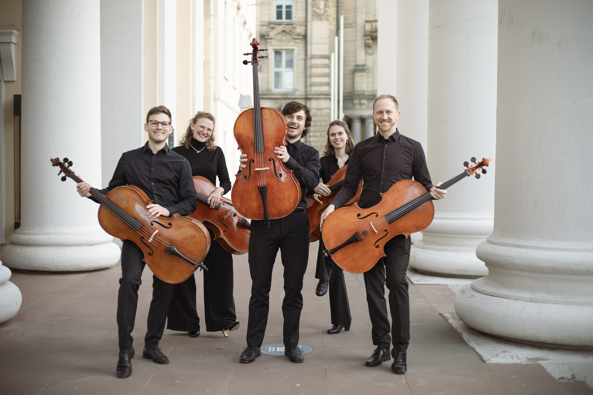
- cello-band-complete.png: A group photo of the full eight-person ensemble in matching grey t-shirts, posed with their cellos against a white background. One member holds a cello overhead. Used as the current hero image.
	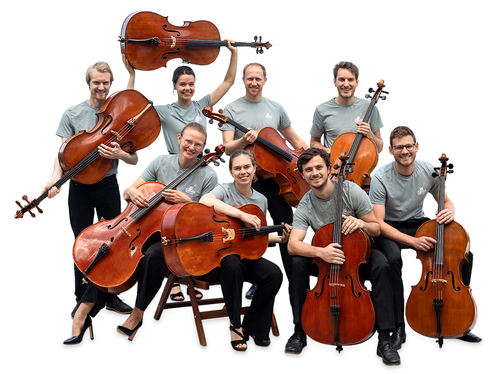
- cello-band-foto.png: A cutout-style graphic of the former five-person ensemble, separated from the original background for compositing or hero use.
	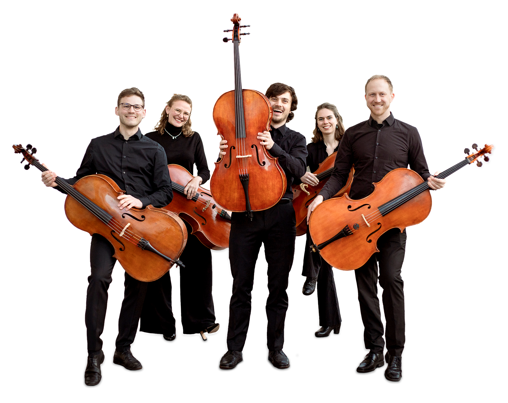

## Performance Photos

- cello-closeup-orange.jpg: A warm orange monochrome close-up of multiple cellos, bows, and blurred sheet music, used more like a graphic texture than a documentary photo.
	
- cello-closeup-natural.jpg: A natural-color close-up of two cellos being played, with a music stand and sheet music blurred in the foreground.
	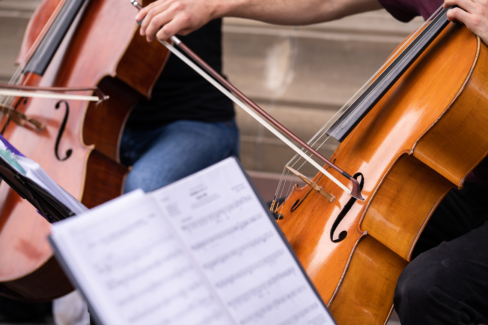
- street-performance-wide.jpg: A wide outdoor performance shot showing the group seated in a row on a city street in front of a stone building.
	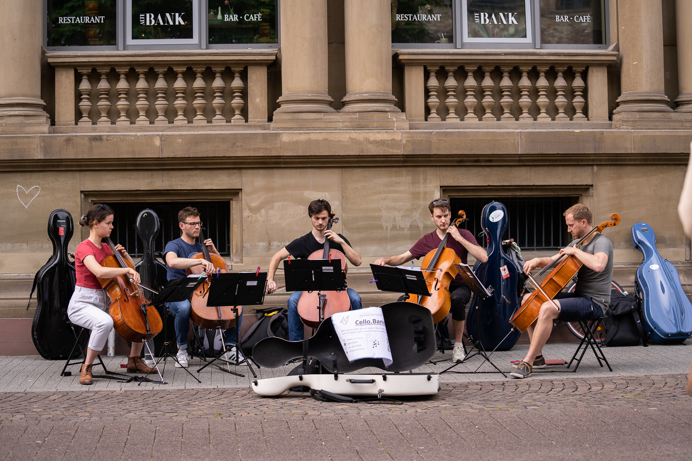
- bowing-hand-detail.jpg: A vertical detail shot of a player's bowing hand and cello body, focused on wood grain, strings, and bridge.
	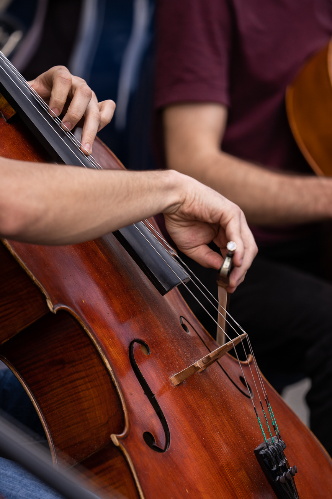
- players-closeup-dof.jpg: A shallow-depth-of-field close-up of several players and instruments, emphasizing movement and overlapping cello shapes.
	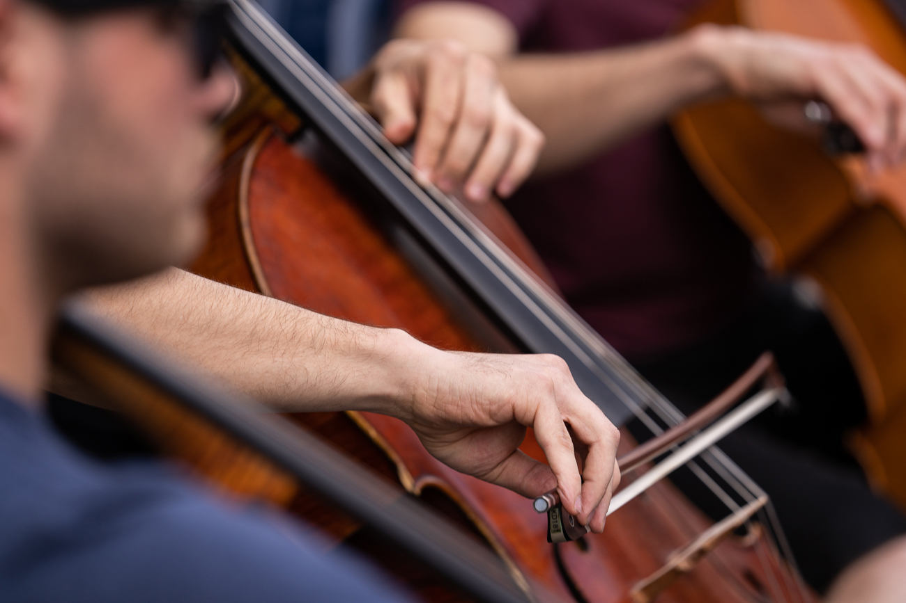
- fingerboard-closeup.jpg: A tight close-up of a left hand on the fingerboard with another cello blurred behind it.
	

## Crops And Isolated Objects

- cello-band-circle.png: A circular crop of the orange-tinted cello close-up, suitable for badges or decorative overlays.
	
- cello-kasten-single.png: A full-height isolated white cello case on a transparent background.
	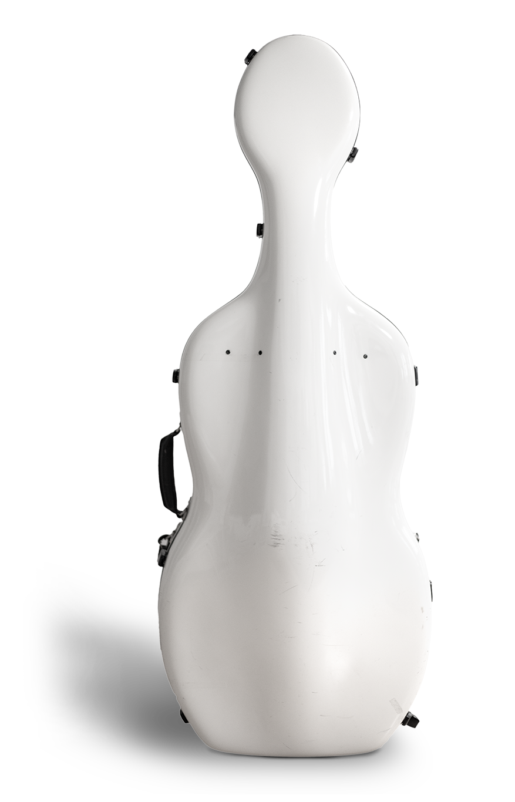
- cellokasten-celloband-bg.jpg: A white cello case placed to the left with large clean negative space on the right, suitable as a background image.
	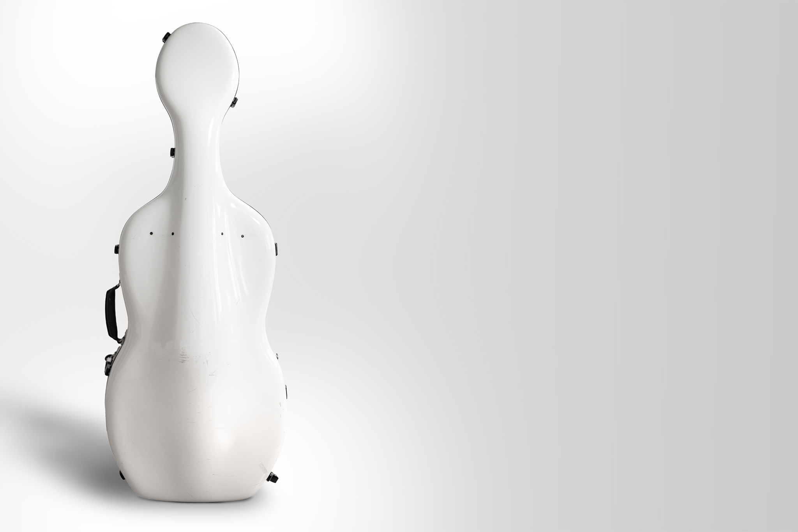

## Branding

- cello-band-logo.png: The main orange Cello Band logo with a stylized cello integrated into the wordmark.
	

## Sticker Illustrations

- cello-band-sticker_about.png: A rounded yellow sticker with the word "hello," musical notes, a microphone, and part of a cello neck.
	
- cello-band-sticker_buchung.png: A minimal round olive-green sticker with musical notes and a looping line, more abstract than the other stickers.
	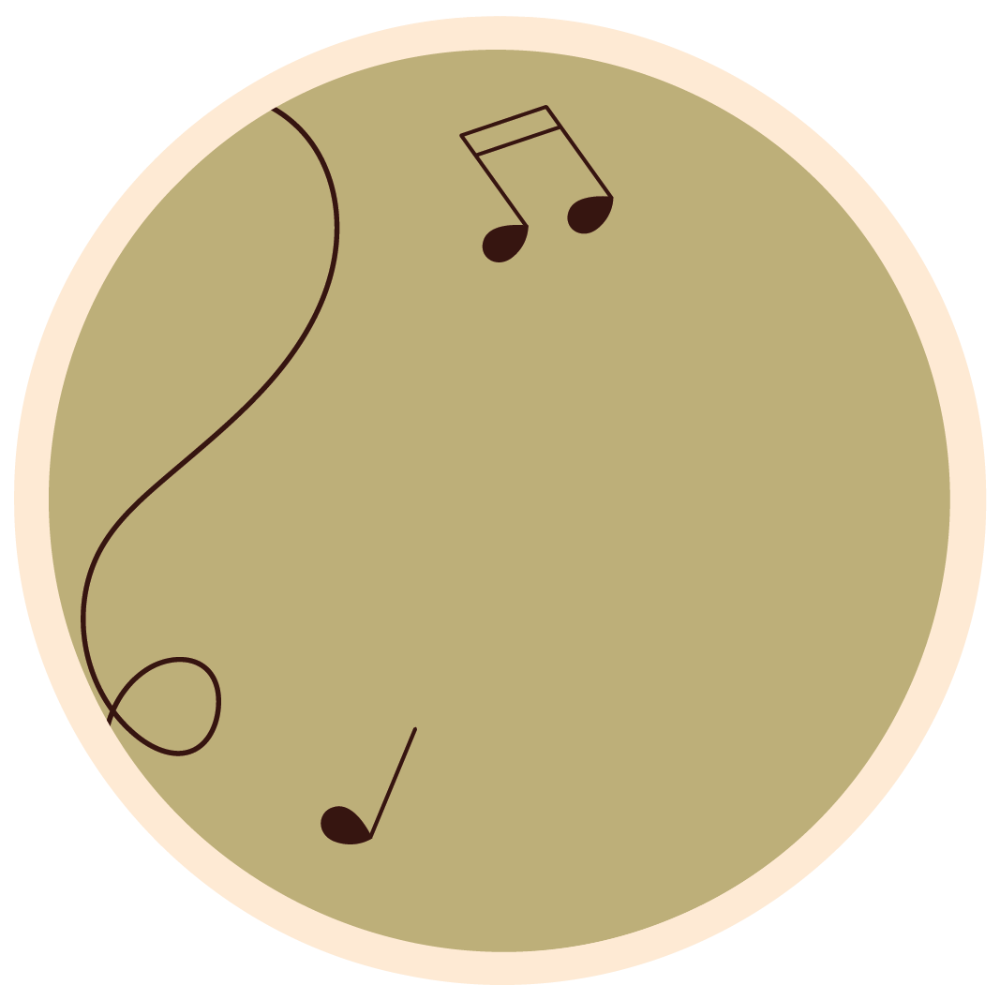
- cello-band-sticker_media.png: A blue round sticker showing a vinyl record, a speaker, and floating music notes.
	
- cello-band-sticker_news.png: A blue round sticker with a retro radio and musical notes.
	
- cello-band-sticker_repertoire.png: An olive-toned round sticker with a cello illustration and a sheet of music.
	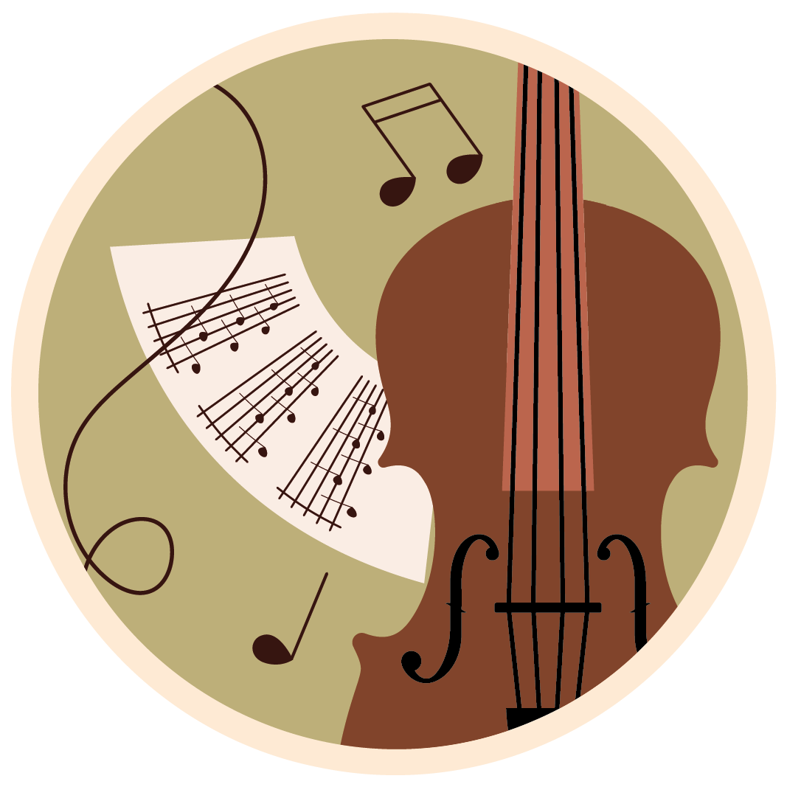

## Vector Shapes

- cello-band-vector-1.svg: A large orange circle with a grid of small black dots offset across its lower-left area.
	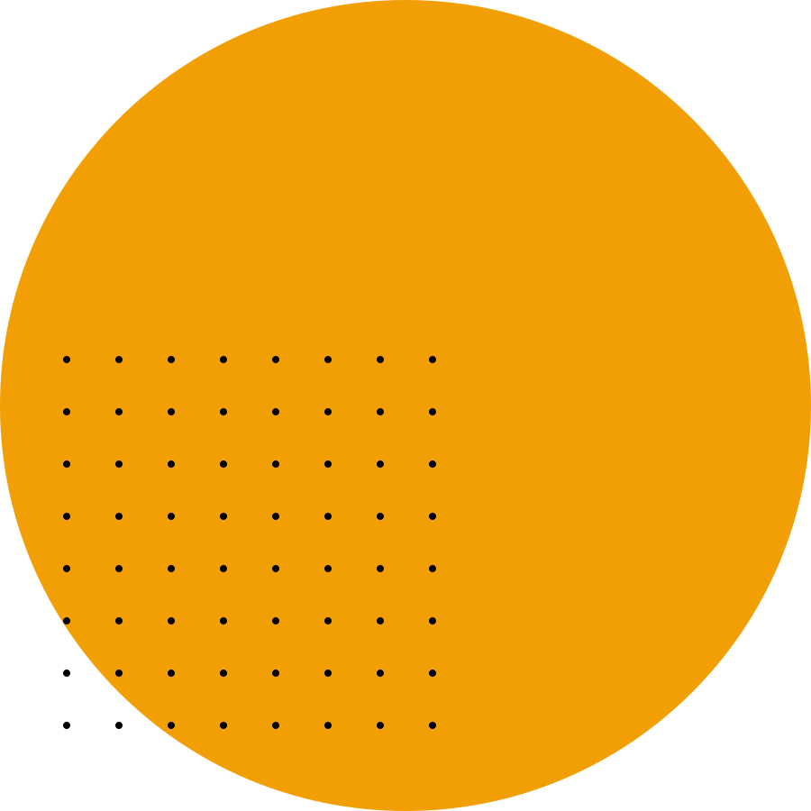
- cello-band-vector-2.svg: A pale mint diamond set over a regular black dot grid.
	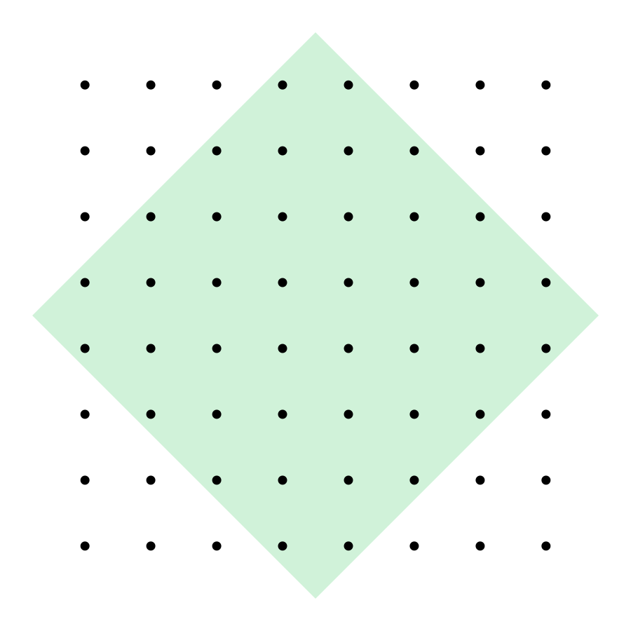