# Fotos – Die Cello.Band

## 20210925_165425015_iOS.jpg
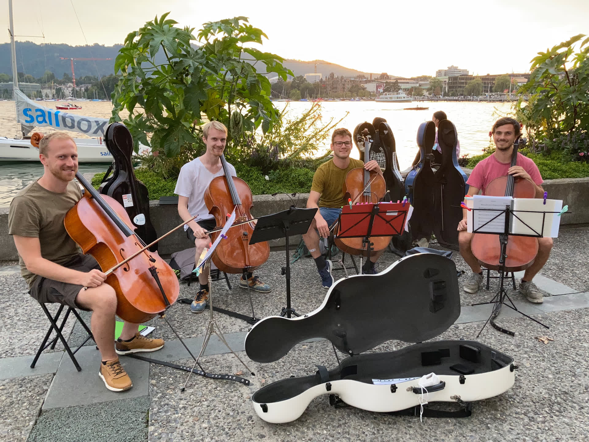
- **Shows:** Outdoor cello performance on a waterfront promenade at sunset. Boats and a harbor visible in the background, "sailbox" signage, mountains/hills in the distance.
- **Quality:** Good. Smartphone photo, bright natural light, well-exposed.
- **People:** 5 cellists seated with their instruments, plus at least 2 additional people partially visible in the back.
- **Description:** Five cellists sit in a row on a lakeside/harbor terrace, playing cellos with music stands in front of them. Open cello cases (white and black) lie on the stone ground. The setting is scenic with water, moored boats, and a warm sunset sky. Casual summer attire. Relaxed, informal performance atmosphere.

## 20221205_194308117_iOS.heic
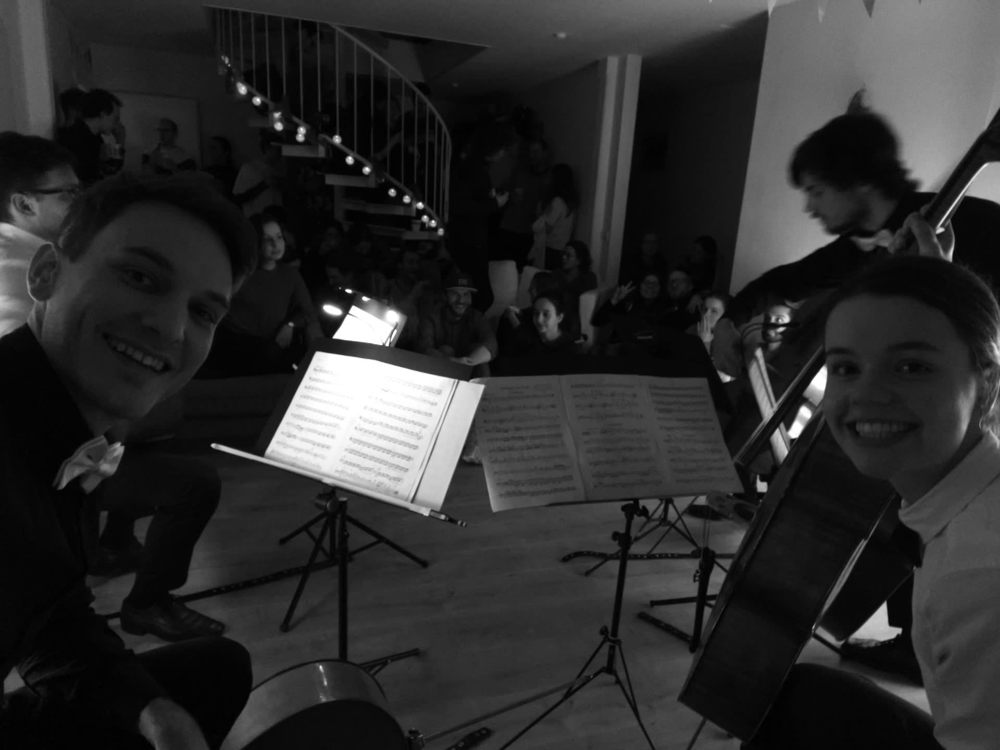
- **Shows:** Intimate house concert, selfie perspective. Black and white photo.
- **Quality:** Medium-low. Smartphone selfie, black & white, some noise, wide-angle distortion.
- **People:** 2 musicians clearly visible in foreground (1 male, 1 female). ~15–20 audience members in background sitting on floor and spiral staircase.
- **Description:** A selfie taken from the musicians' perspective during an intimate house concert. Sheet music on stands is illuminated. A spiral staircase with fairy-light decorations is packed with audience members sitting on the steps and the floor. Dark, atmospheric ambiance. Cozy, private-event feel.

## 7I5A7263-o.jpg
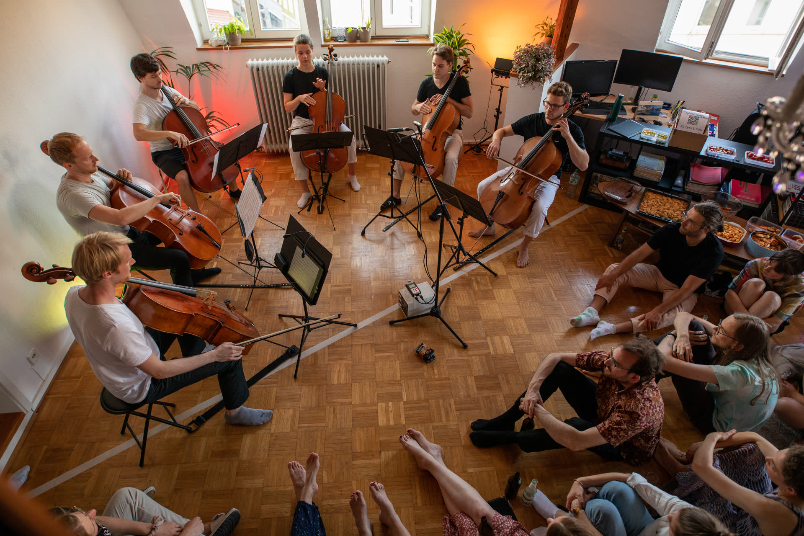
- **Shows:** House concert from a bird's-eye view. Living room performance with audience.
- **Quality:** High. Professional photo, well-composed overhead shot, warm ambient lighting.
- **People:** 5 cellists performing in a semicircle, ~8 audience members sitting closely around them.
- **Description:** Overhead view of a living room concert. Five cellists sit in a semicircle on parquet flooring, surrounded by a small audience seated on the floor and chairs. Colorful ambient lighting (red/orange glow) creates a warm atmosphere. A desk/workspace area is visible in the corner. Music stands and a small monitor/speaker on the floor. Very intimate, close-proximity setting.

## 7I5A7275-o.jpg
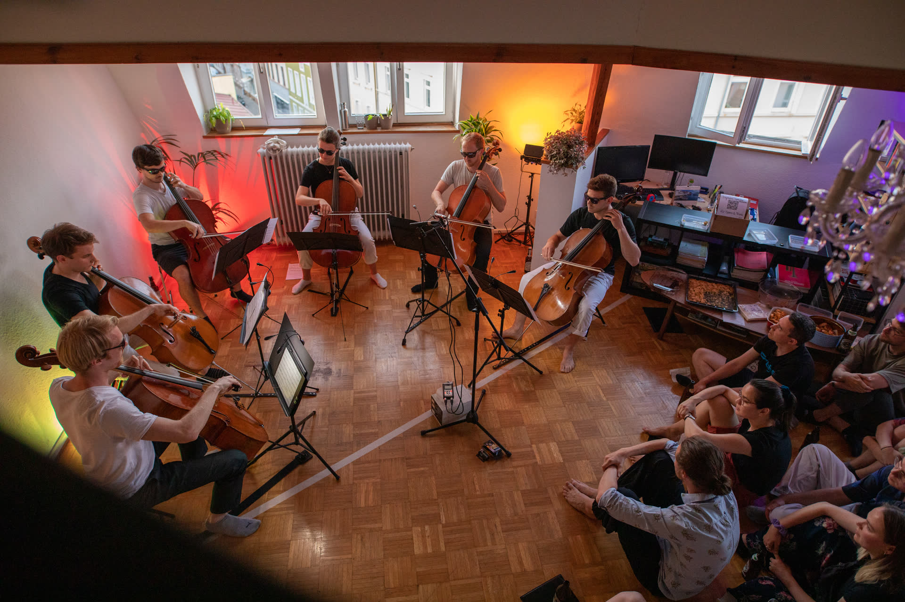
- **Shows:** Same house concert as 7I5A7263, slightly different overhead angle.
- **Quality:** High. Professional photo, same overhead perspective, slightly wider framing.
- **People:** 5 cellists, ~8 audience members.
- **Description:** Nearly identical scene to 7I5A7263-o.jpg but from a slightly shifted elevated viewpoint. The framing includes more of the room's edges—windows on two walls, a door visible. Same warm colored lighting. The audience is tightly grouped, some leaning back casually. A Christmas tree or decorative lights faintly visible in one corner.

## 7I5A8956.jpg
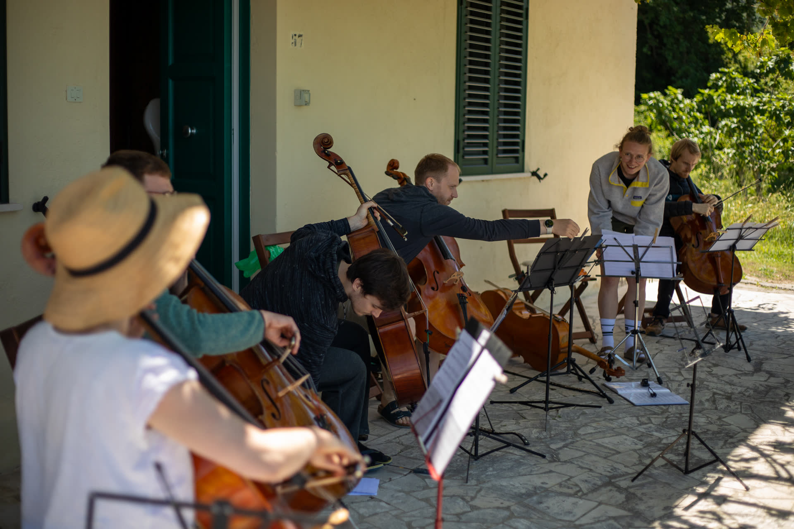
- **Shows:** Outdoor rehearsal/performance at a Mediterranean villa terrace.
- **Quality:** High. Professional photo, good natural light, nice depth of field.
- **People:** ~5 cellists performing. 1 audience member in foreground (woman with straw hat, seen from behind).
- **Description:** Cellists perform on a stone-paved terrace outside a building with green wooden shutters, likely in Italy. One cellist reaches to turn a page on a music stand. Lush greenery surrounds the scene. A woman in a straw hat watches from the foreground. Bright, sunny day. Casual rehearsal or informal outdoor concert.

## 7I5A9046-2.jpg
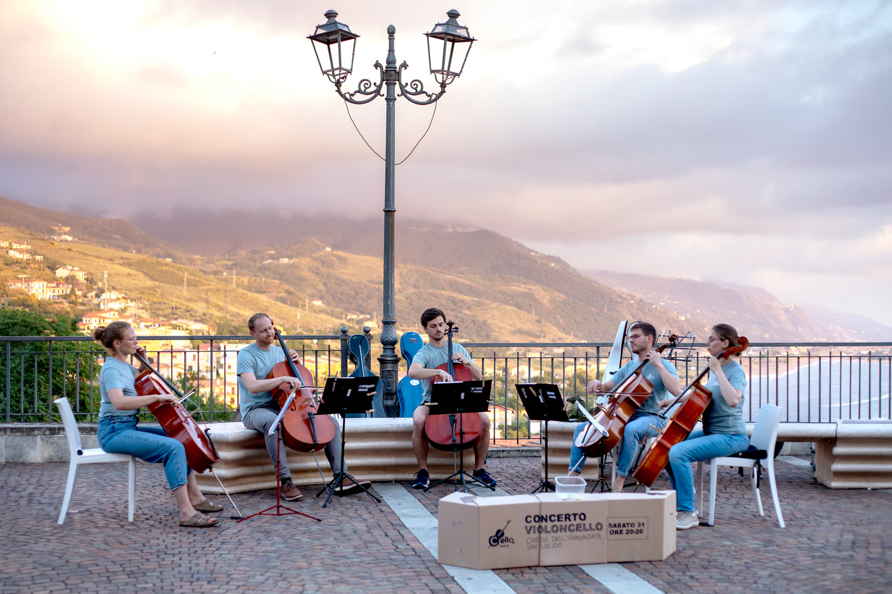
- **Shows:** Outdoor concert on a scenic hilltop terrace overlooking mountains and coastline.
- **Quality:** High. Professional photo, dramatic sky, stunning scenic backdrop.
- **People:** 5 cellists performing.
- **Description:** Five cellists perform on a wide terrace/piazza with a dramatic Mediterranean coastal panorama behind them. Mountains, sea, and a small town visible below. An ornate street lamp stands in the center. A sign/banner reads "CONCERTO VIOLONCELLO." All musicians wear matching light blue shirts. Clouds create a dramatic, painterly sky. One of the most visually striking photos in the collection.

## 7I5A9205.jpg
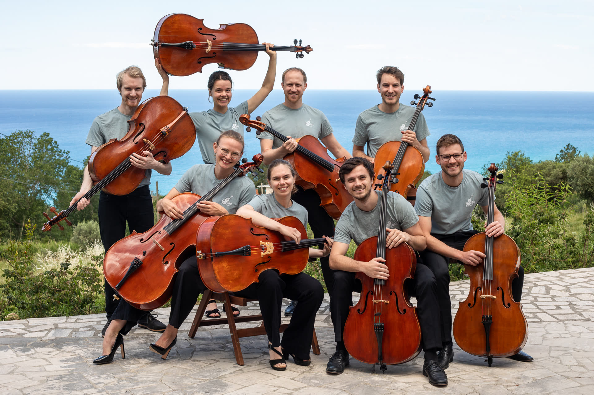
- **Shows:** Group photo of the ensemble posing with cellos, sea in background.
- **Quality:** High. Professional photo, bright sunlight, vivid colors.
- **People:** 8 cellists (4 men, 4 women).
- **Description:** Eight cellists in matching grey t-shirts pose on a stone terrace with the blue Mediterranean sea visible behind them. Back row: 4 people holding cellos aloft above their heads. Front row: 4 people seated/kneeling, holding cellos. Fun, energetic group portrait. Olive trees and greenery frame the sides. Bright, sunny day.

## 7I5A9264.jpg
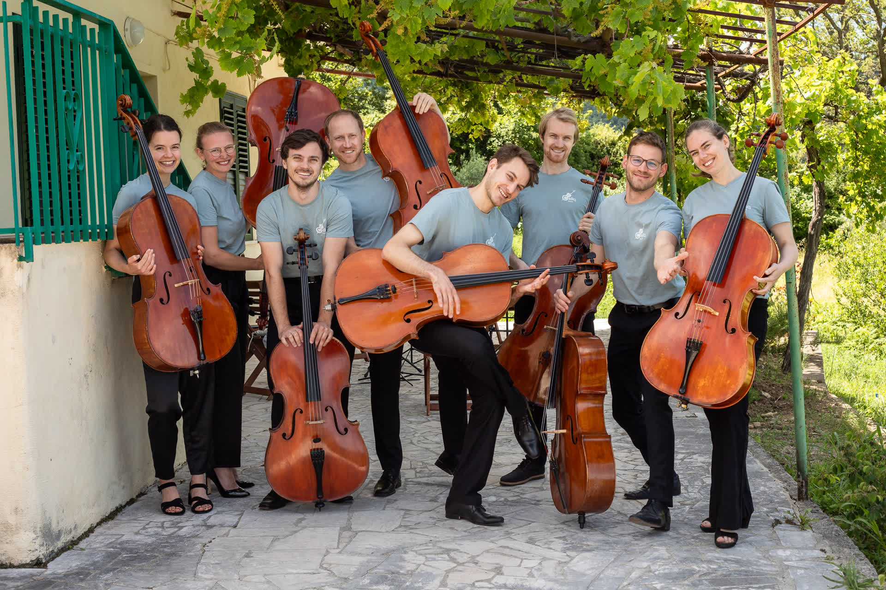
- **Shows:** Group photo under a vine-covered pergola/archway.
- **Quality:** High. Professional photo, natural dappled light through leaves.
- **People:** 8 cellists (4 men, 4 women).
- **Description:** Eight cellists stand in a group under a grape-vine covered pergola walkway, each holding their cello. Matching grey t-shirts, casual poses, friendly smiles. A green metal gate/fence is visible on the left. Stone paving underfoot. Mediterranean garden setting. Warm, relaxed group portrait.

## 7I5A9303.jpg
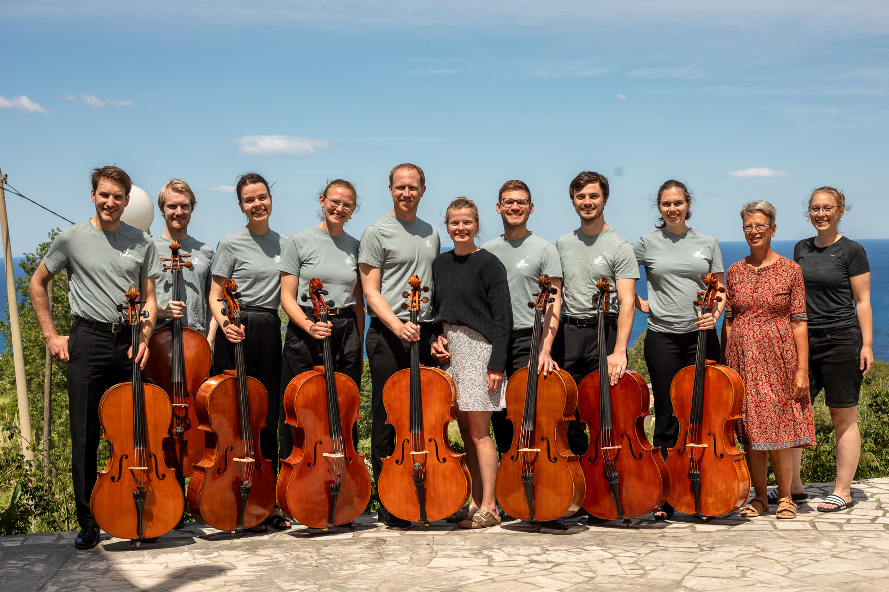
- **Shows:** Formal group line-up photo with cellos, sea/sky backdrop.
- **Quality:** High. Professional photo, clean composition, wide-angle.
- **People:** 11 people total — 9 cellists in grey shirts + 1 woman without a cello (in a red/patterned dress, likely host or organizer) + 1 additional person at the end.
- **Description:** The full ensemble stands in a single line on a terrace, each person standing behind their cello. Blue sky and sea in the background. Clean, formal line-up portrait. Matching grey t-shirts. The woman in the red/patterned dress on the right appears to be a host or organizer. Bright midday sun.

## Anke_Schirocki-05944-k.jpg
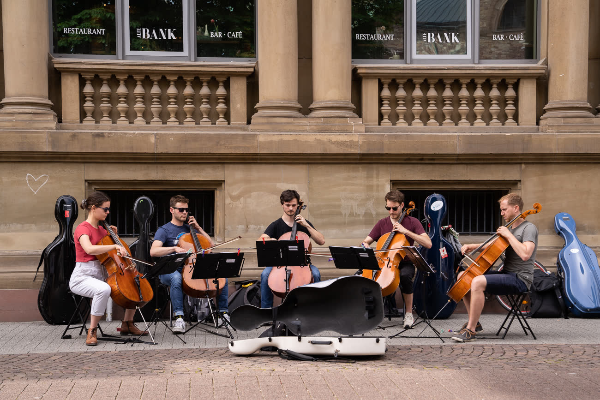
- **Shows:** Street performance (Straßenmusik) in front of a grand sandstone building.
- **Quality:** High. Professional photo (credit: Anke Schirocki), good exposure, urban setting.
- **People:** 5 cellists performing (3 men, 2 women).
- **Description:** Five cellists perform seated in a row on a city sidewalk/square in front of a grand sandstone building with "BANK" restaurant/bar-café signage. Music stands set up, cello cases (white, black, blue) leaning against the building's base. Balustrade above. Summer attire, some wearing sunglasses. Urban busking/street performance atmosphere.

## Anke_Schirocki-06084-k.jpg
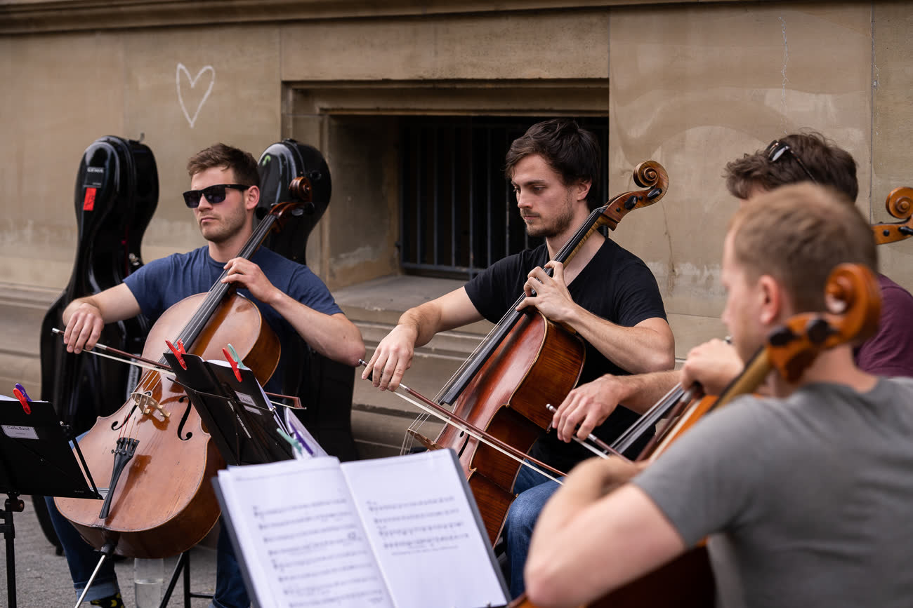
- **Shows:** Close-up of cellists during street performance.
- **Quality:** High. Professional photo (credit: Anke Schirocki), shallow depth of field, intimate close-up.
- **People:** 3 cellists visible (2 men in focus, 1 partially visible on right edge).
- **Description:** Close-up shot of cellists playing during the street performance. Two young men in the center and left, one wearing sunglasses, deeply focused on their playing. Sheet music on a stand in front. Sandstone wall behind them with a small chalk heart drawing. The shallow depth of field creates a nice bokeh on the third cellist at the right edge.

## Anke_Schirocki-06198-k.jpg
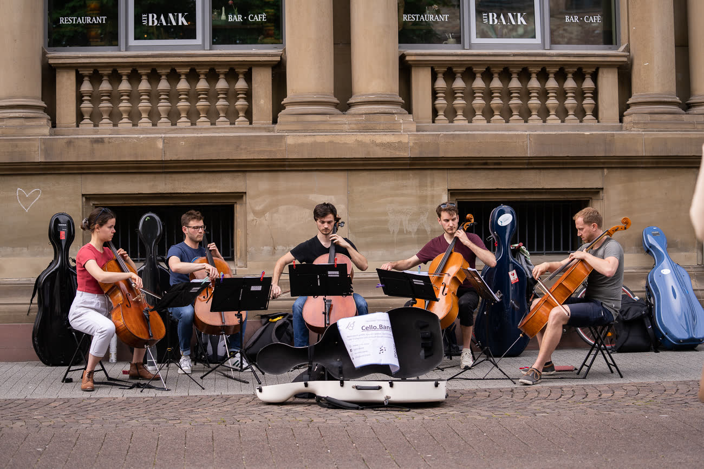
- **Shows:** Street performance, wider angle of the same scene as 05944.
- **Quality:** High. Professional photo (credit: Anke Schirocki), wide-angle, good context.
- **People:** 5 cellists performing (same group as 05944).
- **Description:** Wider-angle view of the five cellists performing on the street. "BANK" signage clearly visible on both sides of the building facade. Blue and white cello cases propped against the wall. A "Cello.Band" sign/case visible in the center. The grand four-arched sandstone building provides an elegant backdrop. Pedestrian zone/square setting.

## Baden-baden.JPG
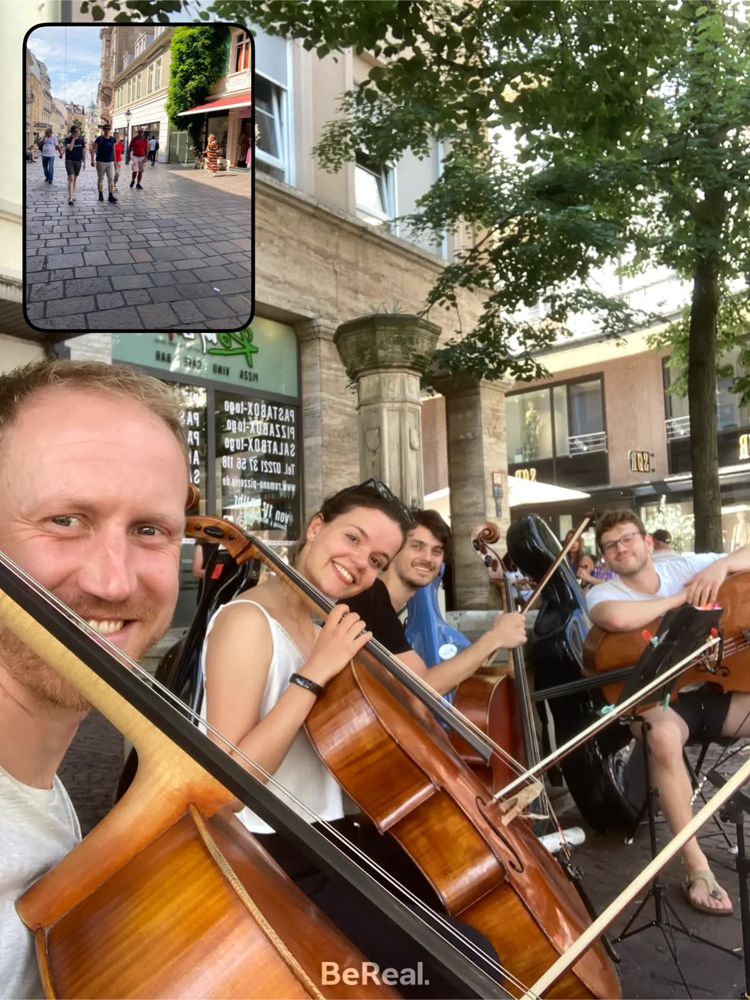
- **Shows:** BeReal selfie during a street performance in Baden-Baden.
- **Quality:** Low-medium. Smartphone selfie, BeReal app format with dual-camera inset, "BeReal." watermark.
- **People:** 4 cellists visible (selfie taker + 3 others).
- **Description:** Casual BeReal-format selfie from one of the cellists during an outdoor street performance. The main image shows the selfie-taker in the foreground with 3 other cellists behind him, performing on a tree-lined pedestrian street. The inset photo (top-left) shows a different angle of the same street. Urban setting, summer, casual. Spontaneous social media capture.

## Hauskonzert_0.jpg
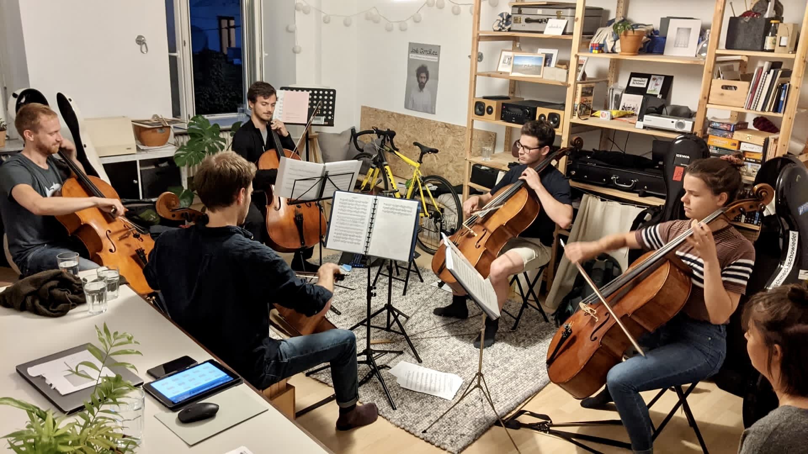
- **Shows:** Rehearsal or house concert in a living room / home studio.
- **Quality:** Medium. Appears to be a slightly darker indoor shot, adequate lighting, casual composition.
- **People:** 5 cellists.
- **Description:** Five cellists rehearse or perform in what appears to be a home studio or living room. Wooden shelves filled with books, audio equipment, and various objects line the back wall. A yellow bicycle hangs on the wall. Music stands with sheet music are set up. A tablet/iPad is visible on a table in the foreground. Cozy, informal rehearsal setting.

## Hauskonzert_3.jpg
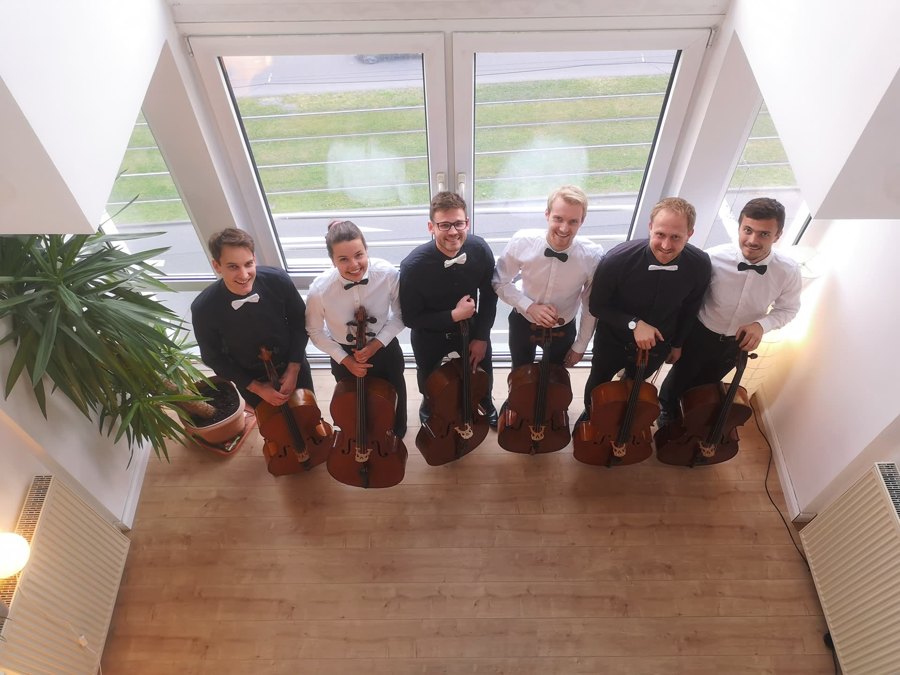
- **Shows:** Formal group portrait of six young men with cellos, shot from above.
- **Quality:** Medium-good. Indoor, slightly flat lighting, but well-composed overhead angle.
- **People:** 6 men.
- **Description:** Six young men sit side by side in a modern room with a sloped ceiling and large windows behind them. All wear semi-formal attire — white dress shirts with black sweaters or bow ties. Each holds a cello in front of them. The photo is taken from an elevated angle. Clean, coordinated group portrait. Early Cello.Band lineup.

## IMG_7088.JPG
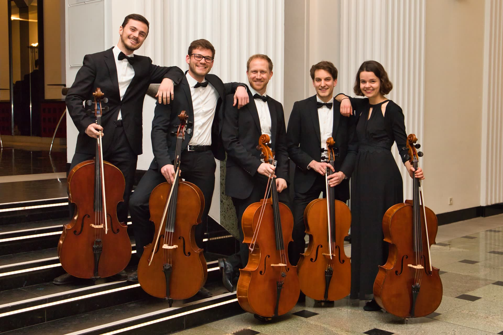
- **Shows:** Formal concert group photo in a grand foyer/hall with marble stairs.
- **Quality:** High. Well-lit, sharp, professional or semi-professional photo.
- **People:** 5 musicians (4 men, 1 woman).
- **Description:** Five musicians in full formal concert attire — men in black tuxedos with bow ties, woman in an elegant black dress — stand together on broad marble steps in a grand hall with classical columns and marble flooring. Each holds a cello. Post-concert or pre-concert portrait. Elegant, prestigious venue. The most formally dressed photo in the collection.

## Schloss_0.jpg
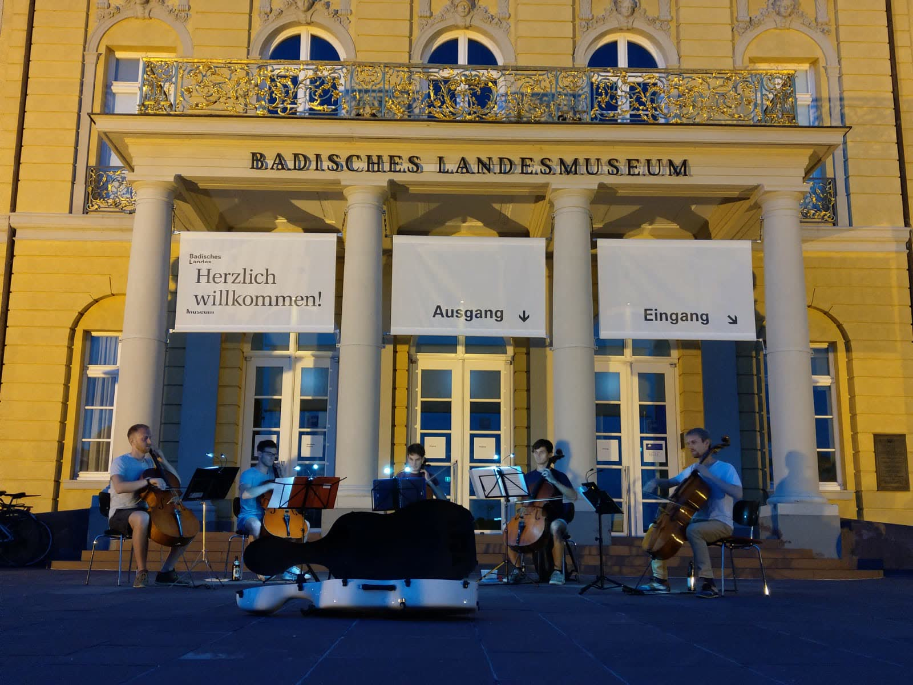
- **Shows:** Evening outdoor performance in front of the Badisches Landesmuseum (Karlsruhe Palace/Schloss).
- **Quality:** Medium. Evening/night shot, some noise, atmospheric blue stage lighting.
- **People:** ~5 cellists performing.
- **Description:** Cellists perform outdoors in the evening in front of the grand columned entrance of the Badisches Landesmuseum (Karlsruhe Schloss). Banners read "Herzlich willkommen!", "Ausgang" and "Eingang." Blue-tinted stage lighting illuminates the scene. The yellow palace facade is dramatically lit. A grand, prestigious outdoor concert setting. Slightly lower resolution but very atmospheric.

## Vernissage_14.JPG
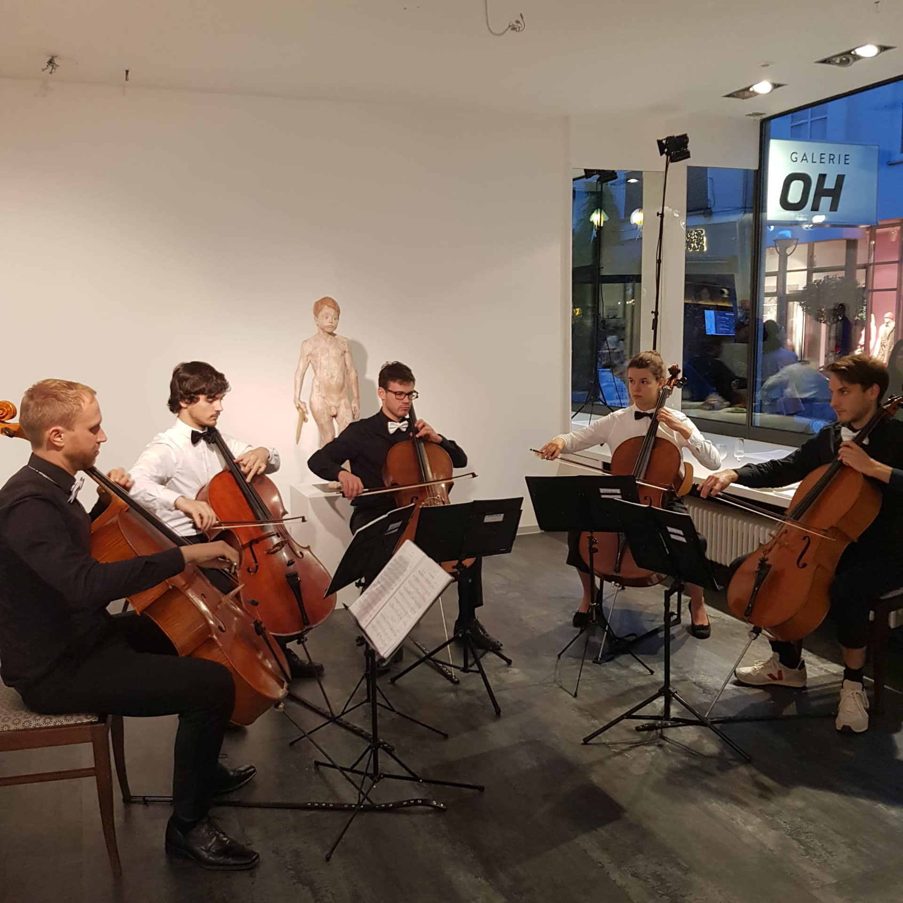
- **Shows:** Performance at art gallery vernissage (opening), "GALERIE OH" visible.
- **Quality:** Medium. Indoor, gallery lighting, slight color temperature variation.
- **People:** 5 cellists.
- **Description:** Five cellists perform in a white-walled art gallery. The "GALERIE OH" sign is visible through the gallery's storefront window. An art piece/sculpture (figurative) stands on a pedestal behind the musicians. Music stands and chairs arranged in the gallery space. Semi-formal attire (white shirts, dark pants). Art exhibition opening / vernissage performance.

## Vernissage_2.jpg
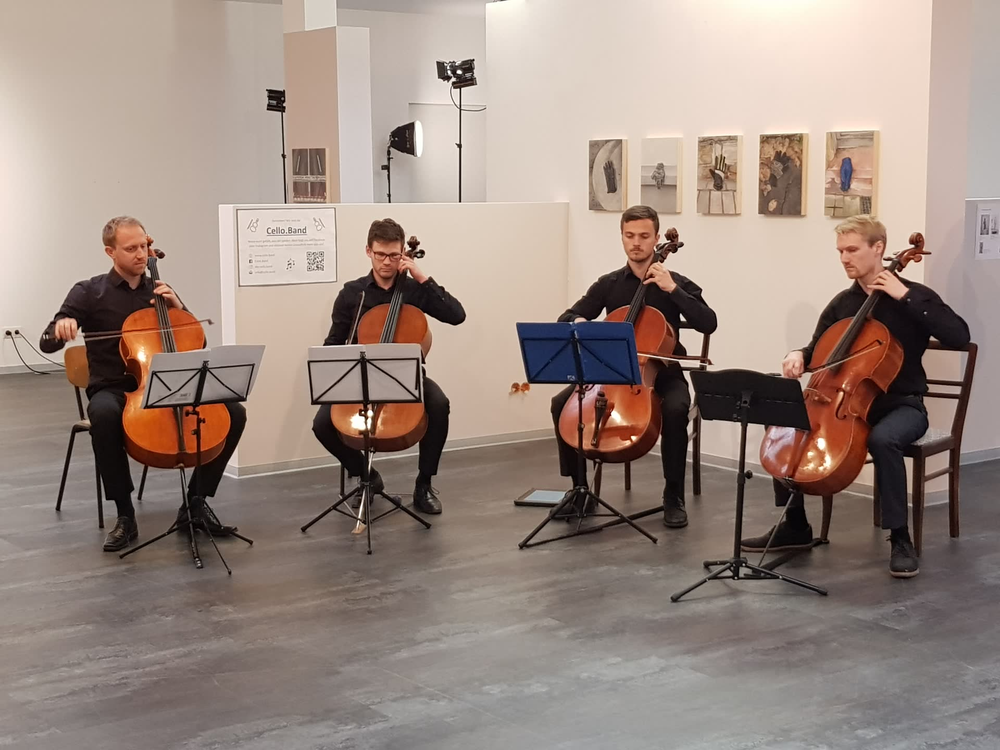
- **Shows:** Performance at art gallery, quartet formation.
- **Quality:** Good. Well-lit gallery space, clean white walls.
- **People:** 4 cellists.
- **Description:** Four cellists perform in a bright gallery space with white walls. Artworks (paintings/prints) hang on the walls behind them. Studio/spot lights on stands illuminate the space. A "Cello Band" poster or sign is visible on the wall. Sheet music on stands. All dressed in dark/black attire. Professional gallery concert setting.

## Vernissage_9.jpg
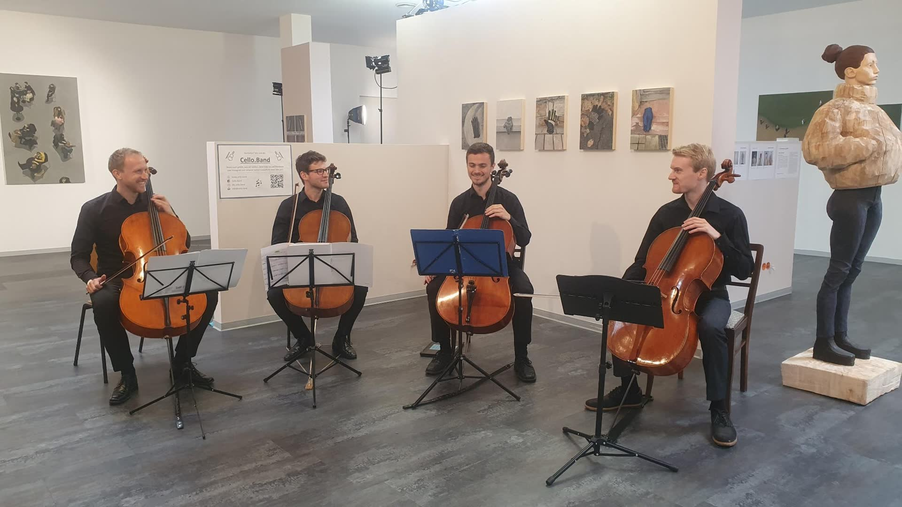
- **Shows:** Performance at art gallery, wider angle showing gallery space.
- **Quality:** Good. Well-lit, captures both musicians and art.
- **People:** 4 cellists.
- **Description:** Four cellists sit with their instruments in a spacious gallery with grey flooring and white walls. Artworks (paintings, drawings) hang on the walls. A large figurative wooden sculpture stands on a pedestal to the right. Music stands arranged in front of the musicians. Dark attire. The gallery is well-lit with track lighting. Artistic performance setting that blends music and visual art.

## Wein_mugge_1.jpg
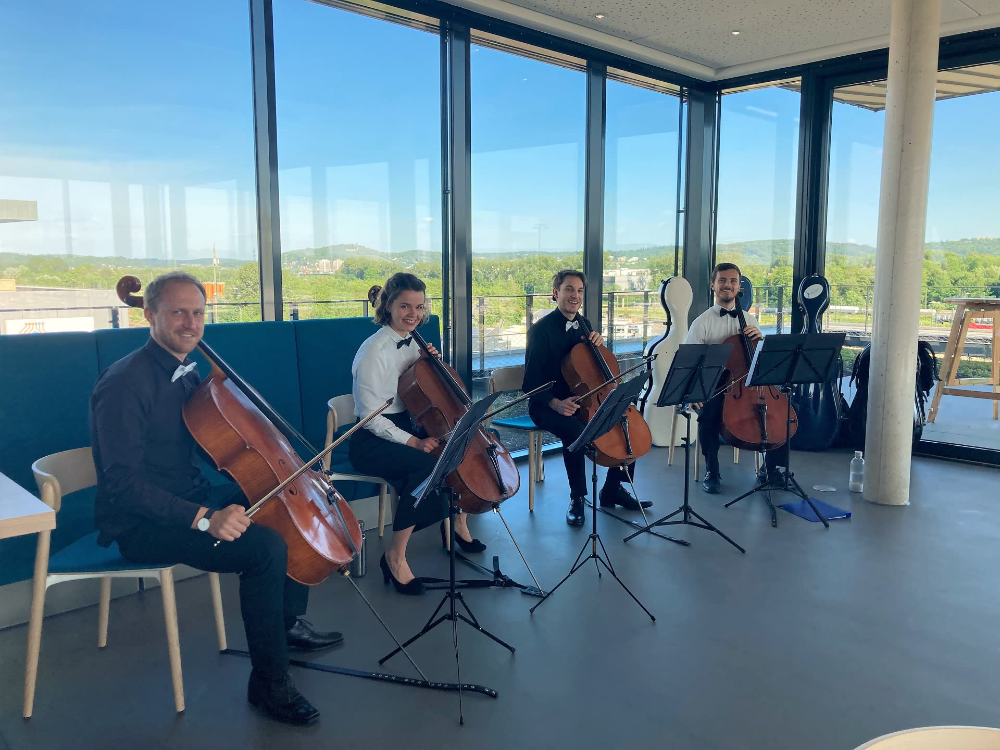
- **Shows:** Performance at a "Wine & Music" (Wein Mugge) event in a modern glass-walled venue.
- **Quality:** Good. Bright natural light from floor-to-ceiling windows, good exposure.
- **People:** 4 cellists (3 men, 1 woman).
- **Description:** Four cellists in formal attire (dark suits, bow ties) perform in a modern, airy room with floor-to-ceiling glass windows overlooking a green landscape. Blue fabric dividers/screens behind them. White cello cases visible. Music stands set up. Panoramic view through windows shows trees and rolling terrain. Elegant, contemporary event venue.

## Wein_mugge_2.jpg
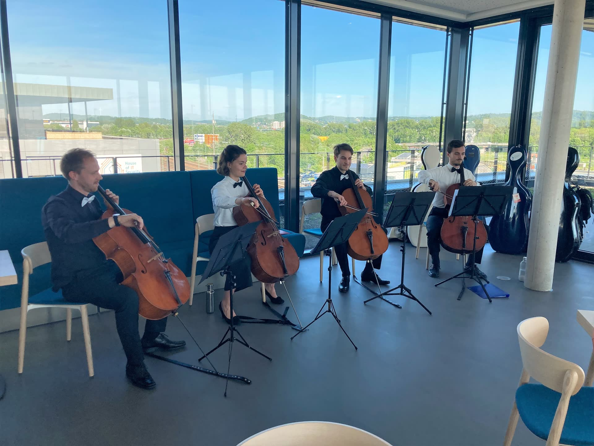
- **Shows:** Same "Wein Mugge" event, slightly different angle.
- **Quality:** Good. Same bright venue, natural light.
- **People:** 4 cellists (same group).
- **Description:** Nearly identical scene to Wein_mugge_1 from a slightly shifted perspective. The four cellists perform with the panoramic window view behind them. Blue dividers, modern furniture (light-colored chair edges visible). The wide glass facade dominates the background. Same formal attire. A relaxed but elegant wine-tasting performance.
